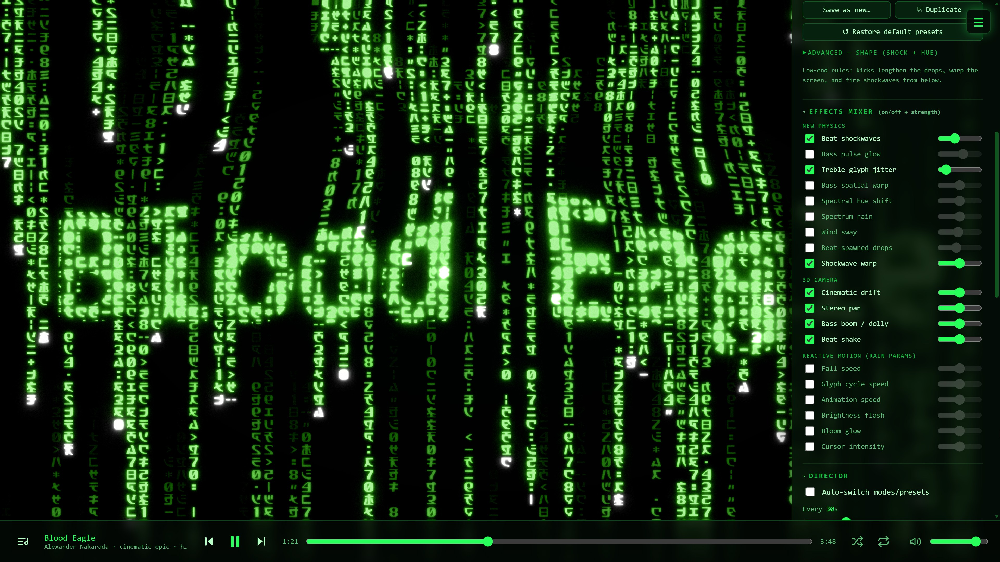

# Matrix Music Visualizer

Turn any song into a wall of reactive Matrix code rain, right in your browser.



Play a track and the famous green rain comes alive with the music: **beats fire
shockwaves** through the glyphs, the **bass warps and blooms** the field, columns
light up as a **live spectrum analyzer**, and the whole palette **shifts hue with the
sound**. Drop into a 3D mode and a **cinematic camera** flies through the falling
code — steered by the stereo mix, dollied by the bass, kicked by every beat.

And it's yours to shape. Thirteen rain looks (classic, operator, nightmare, paradise
and more), **color palettes you can design and save**, a deep **effects mixer** where
every reaction is an on/off + strength dial, and **18 presets** you can tweak, save
and share. Let the built-in **auto-director** DJ the visuals for you — rotating modes,
palettes and presets on the beat and on every drop — or take the wheel yourself. Drag
in your own music and go.

> **Try it live:** enable GitHub Pages on this repo →
> `https://<you>.github.io/matrix-music-visualizer/` — or clone and run it locally
> ([below](#run-it)).

**Under the hood**, it turns [Rezmason's canonical Matrix rain
renderer](https://github.com/Rezmason/matrix) (MIT) into a full music visualizer:
live PCM analysis (beat, BPM, bands, onsets, stereo) drives the rain's every
variable. It runs **two ways**:

- **Standalone** — a zero-build web page with its own player + Web Audio analysis.
  Drop it on any static host (GitHub Pages works out of the box).
- **Embedded** — dropped into a host music player as a pure visualizer, reading the
  host's audio + now-playing over a tiny [embedding contract](#embedding). The host
  owns playback; the viz just visualizes.

No build step, no dependencies — plain ES modules + WebGL.

---

## Run it

Serve the folder with the bundled `serve.py` and open it:

```bash
python serve.py            # http://localhost:8099  (pass a port to override)
```

**Use `serve.py`, not `python -m http.server`** — the stdlib server ignores HTTP
Range requests, so dragging the seek bar would restart the track from the start.
`serve.py` is a tiny zero-dependency threaded static server that adds Range (206)
support; any other Range-capable server (e.g. `npx serve`) works too.

Click **▶** (a user gesture is required to start audio), pick a track, then tick
**React to music**. Drag-and-drop your own audio files anywhere, or use the
playlist's **+ add files**. Seven CC0 (public-domain) demo tracks are bundled — see
[Demo music](#demo-music).

---

## Embedding

Matrix Music Visualizer can run *inside* another music player as a pure visualizer.
A host installs a single global, `window.matrixVizHost`, **before the page loads**;
its presence flips the viz into embedded mode — the host owns playback, the viz's
own transport/playlist are hidden, and audio + metadata come from the host.

The contract is app-agnostic and **pull-based** (the viz reads the freshest audio
each frame, keeping its own render loop):

```js
window.matrixVizHost = {
  // AUDIO — the latest output block. The viz runs its OWN analysis on this, so
  // reactivity is identical standalone vs embedded.
  readAudio(): {
    pcm: Float32Array,        // interleaved, frames * channels
    fftMag: Float32Array[],   // per-channel linear magnitude spectra (blockSize/2 each)
    frames, channels, sampleRate, generation
  } | null,

  // NOW-PLAYING — feeds the song-title splash + the director's track-change switch.
  getNowPlaying(): { title: string, artist?: string } | null,
  onTrackChange(cb): () => void,             // returns an unsubscribe fn

  // OPTIONAL — the "playing" flag / readouts. The viz never drives transport here.
  getPlaybackState?(): { playing: boolean, positionMs?, durationMs? },
};
```

The viz declares back what it wants, so the host can (e.g.) hide its own now-playing
bar: `window.matrixViz.capabilities = { version: 1, ownsPlayback: false }`.

A misbehaving host degrades the viz to calm (it never crashes or spams the console).
The full spec lives at the top of [`app/embed.js`](app/embed.js), and
[`examples/embed-mock.js`](examples/embed-mock.js) is a **working reference host** —
open `?embed-mock` to see embedded mode against demo audio.

---

## Controls

| Key | Action | | Key | Action |
|----|--------|---|----|--------|
| `Space` | Play / pause | | `P` / `⇧P` | Next / random preset |
| `N` / `B` | Next / previous mode | | `⇧N` | Random mode |
| `Tab` | Show/hide control panel | | `R` | Fully random (mode + mixer) |
| `D` | Debug overlay | | `` ` `` | FPS meter |
| `F` | Fullscreen | | `?` | Keyboard cheat-sheet |
| `T` | Song-title splash | | `[` / `]` | Previous / next track |

Every panel section heading is **click-to-collapse** (state persists), and the whole
panel survives a refresh. **Fullscreen** (the `F` key or a **double-click on the
rain**) auto-hides the chrome after a few seconds of stillness and brings it back on
any mouse move. *(In embedded mode the playback keys/rows are omitted — the host owns
transport.)*

Everything is also in the right-hand panel: **Mode**, **Palette** (color scheme + an
opt-in *"UI follows palette"* that re-skins the whole UI), **Reactivity** (master
toggle, intensity, the preset library), the **Effects mixer**, **Transitions**, the
**Director**, and **Backup** (export/import all settings as one file).

---

## What gets pulled from the audio

`app/audio-engine.js` runs an FFT every frame and extracts, all normalized to ~0..1
by per-feature **adaptive gain control** (so a whisper-quiet ambient track and a
wall-of-sound rock track both react well):

- **level / RMS** — overall loudness
- **5 log-spaced bands** — bass · low-mid · mid · high-mid · treble
- **spectral centroid** — brightness/timbre (drives color)
- **spectral flux** — onset energy
- **short & long energy envelopes** — for the director's drop detection
- **stereo balance + width** — L/R imbalance (steers side-to-side camera) + stereo spread

`app/beat-detector.js` + `app/bpm.js` add **beat** (a 0/1 transient), **beatPulse /
beatBass / onset** (decaying envelopes for punchy reactions), a **BPM** estimate
(handles half/double-time), and **beatPhase** (position within the beat). Bass kicks
carry the pulse for bass-heavy music; when the bass is sparse (jazz, classical),
prominent spectral onsets carry it instead.

*(When embedded, the exact same analysis runs on the host's raw PCM/FFT instead of a
Web Audio node — reactivity is identical either way.)*

---

## How the music drives the rain

Two channels feed the shared `A` bridge (`app/presets.js` →
`vendor/matrix/js/reactive.js`):

1. **Continuous knobs** — the rain's own parameters become live, audio-driven
   uniforms: fall speed, glyph cycle speed, animation speed, brightness/contrast,
   decay, cursor intensity, bloom. Each falls back to the mode's base, so silent
   playback looks exactly like vanilla matrix.
2. **New physics** — extra GPU effects, each gated by a toggle: **beat shockwaves**,
   **bass pulse glow**, **treble glyph jitter**, **bass spatial warp**, a full **3D
   camera rig** (strafe/boom/dolly/pan/tilt/roll through volumetric modes), **spectral
   hue shift**, **Spectrum Rain** (columns mapped to FFT frequencies), **beat-spawned
   drops**, **shockwave warp**, and **wind sway**.

### The effects mixer

Every shader effect, the four camera parts, and the seven continuous "reactive
motion" knobs appear in the **Effects mixer** as one row each — an **on/off checkbox
+ a strength slider** (0–2). Enabling an effect the active preset didn't use brings
it in at a sensible default, so any reactive behavior can be added, removed, or dialed
in independently. A global **Intensity** slider scales the whole mixer.

### Presets (18 built-in, + your own)

Loading a preset sets the whole mixer + intensity, and many now carry **scene
bindings** — a signature palette and/or a mode they jump to on apply:

`Pulse Rain` · `Tempo Drive` · `Spectrum Bleed` · `Spectrum Rain` · `Bass Quake`
(→ Fire) · `Cursor Storm` · `Neon Drift` (→ Synthwave) · `Strobe Core` (→ Plasma) ·
`Deep Space` (→ Morpheus 3D) · `Orbit` (→ Trinity 3D) · `Aurora` (→ Ice) · `Glitch
Matrix` (→ Toxic) · `Tempest` · `Nightmare Fuel` (→ Nightmare) · `Compile` (→ Operator
+ Amber) · `Dreamwave` (→ Twilight + Synthwave) · `Stereo Field` · `Swarm` (→ Bugs
3D)`, plus a generative **🎲 Random** that rolls a fresh look.

Presets are editable and savable — a **• unsaved** flag shows pending changes, then
**Save** / **Save as new…**. Everything persists to `localStorage`; the **Backup**
section exports/imports *all* settings as one JSON file.

### Modes (13)

classic · resurrections · 3D rain · megacity · operator · nightmare · paradise ·
trinity (3D) · morpheus (3D) · bugs (3D) · palimpsest · twilight · neomatrixology —
plus post-effect palettes (mode-default / plain / spectrum stripes / Fire / Ice /
Amber / Synthwave / Toxic / Plasma / Ocean / a generative Random).

### The director

`app/director.js` rotates the mode, palette and/or preset on a timer, **on musical
drops** (rising edge of short-vs-long energy), and **on track change**. Preset choice
is mode-aware (the volumetric-camera presets only pair with 3D modes). Tune the
interval, drop sensitivity, per-axis frequencies, and rotation method (random /
shuffle / cycle).

### Transitions & song titles

Changes don't have to hard-cut. The **Transitions** section blends one look into the
next with adjustable length, type (Simple / Complex / Random) and easing:

- **Preset change** (same mode) — the reactivity **parameters** crossfade; *Complex*
  staggers it so **colours lead, reactivity lags**.
- **Palette change** between two ramp palettes — the **gradient morphs** in place on
  the one live pipeline (a true recolour, no second render).
- **Mode change** — two rendered pipelines **crossfade** (a composite blend).

The **song-title splash** shows the track title on track change (or the `T` key).
*Overlay* is a palette-tinted text overlay; the **Glyph** modes burn the title into
the rain itself — *Mask* (glyphs light up in place, then dim), *Hold and Rain* (a
pixel-font title that holds, then the lit cells **fall as rain**), *Fall* (a rigid
title falls through the stage), and *Random*.

---

## Demo music

Seven CC0 (public-domain) tracks are bundled in `music/`, chosen to stress the
analysis differently — two beat-heavy references, a dynamic cinematic piece, a dark
ambient one, jazz, chiptune-techno and darksynth:

| Track | Artist |
|-------|--------|
| Soundtrack From the Starcourt Mall | Bryan Teoh |
| Blippy Trance | Kevin MacLeod |
| Blood Eagle | Alexander Nakarada |
| Alien Spaceship Atmosphere | Kevin MacLeod |
| Bass Meant Jazz | Kevin MacLeod |
| Action Techno | Komiku |
| Night Driving | HoliznaCC0 |

All are **CC0 1.0** (no attribution required); per-track provenance is in
[`music/CREDITS.md`](music/CREDITS.md). Drop `.mp3`/`.ogg`/etc. into `music/` and add
a row to `music/playlist.json` to bundle your own.

---

## Acknowledgements & license

Matrix Music Visualizer's own source (`app/`, `examples/`, `index.html`, `serve.py`)
is **MIT-licensed** — see [`LICENSE`](LICENSE).

- **[Rezmason/matrix](https://github.com/Rezmason/matrix)** (MIT) — the digital-rain
  renderer under `vendor/matrix/`, vendored and modified for music reactivity. Every
  change is marked `// MATRIX-VIZ` and catalogued in
  [`MODIFICATIONS.md`](MODIFICATIONS.md); the upstream license is kept at
  `vendor/matrix/LICENSE`. Huge thanks to [Rezmason](https://github.com/Rezmason) —
  this project would not exist without that renderer.
- **[regl](https://github.com/regl-project/regl)** (MIT) — the WebGL wrapper it uses.
- **Demo music** — CC0 by Kevin MacLeod, Alexander Nakarada, Bryan Teoh, Komiku and
  HoliznaCC0 (via FreePD and the Free Music Archive).

Full third-party details: [`THIRD-PARTY.md`](THIRD-PARTY.md).

*The "Matrix" digital-rain look is an homage; this project is not affiliated with or
endorsed by Warner Bros. or the Matrix films.*
